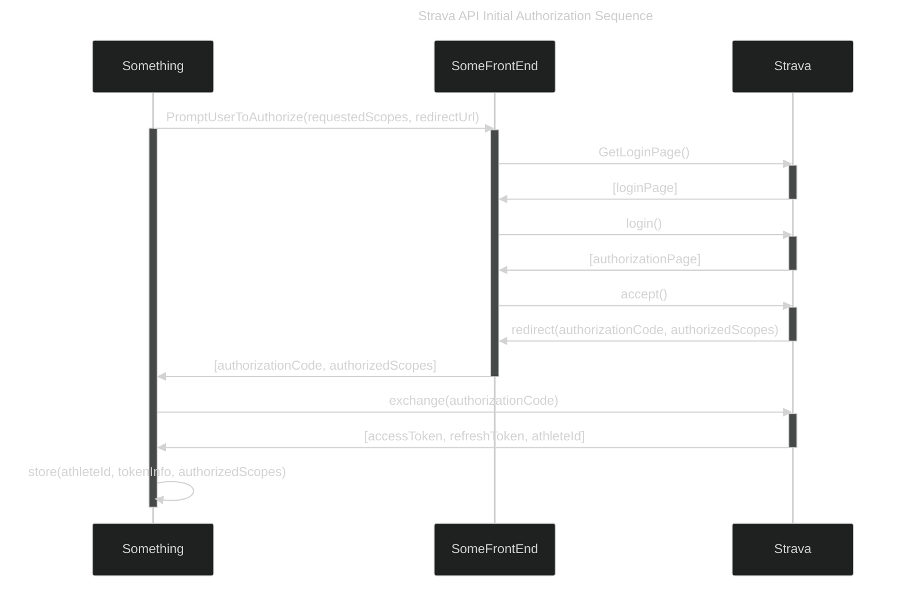
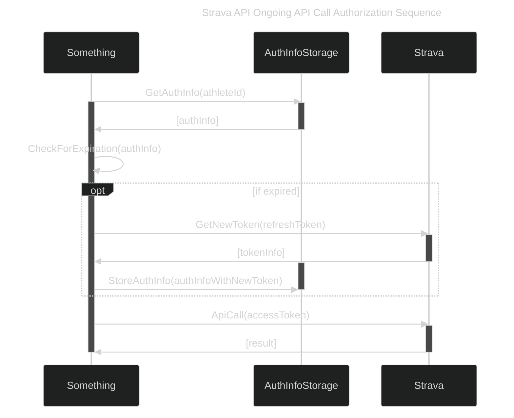
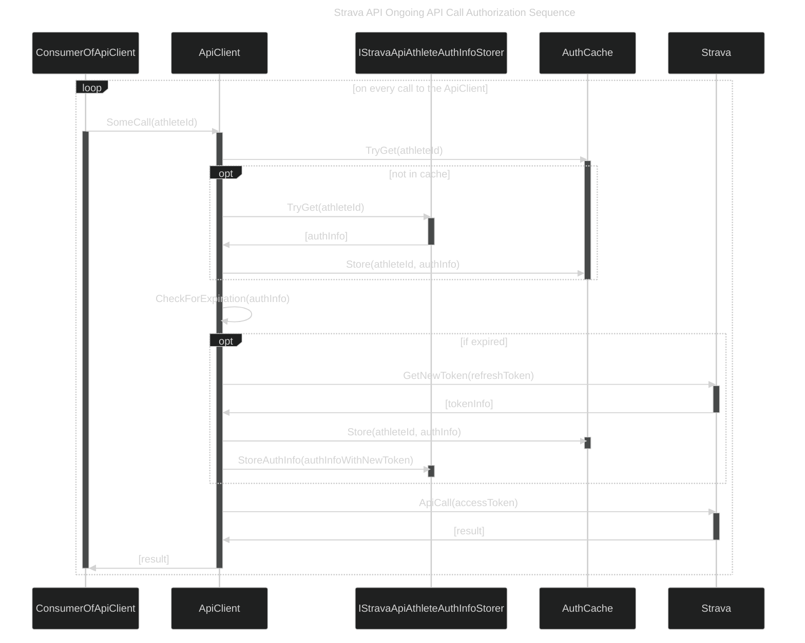

# StravaUtilities

A library for making calls to the [Strava API](https://developers.strava.com/docs/), written in C#.

Mostly it contains an API client. But I am calling it "utilities" because I may add more complex functions to it than just a pure API client would have.

## Prerequisites

To call the API, you need to go through your "API application", kind of like your access policy to use the Strava API.

They describe how to create an API app here: https://developers.strava.com/docs/getting-started/#account

## Technologies / references

Standard tools:

- [.NET](https://learn.microsoft.com/en-us/dotnet/)
  - [C#](https://learn.microsoft.com/en-us/dotnet/csharp/)
- [Azure Key Vault](https://learn.microsoft.com/en-us/azure/key-vault/general/) for storing Strava API access token
  - [SecretClient](https://learn.microsoft.com/en-us/dotnet/api/overview/azure/security.keyvault.secrets-readme?view=azure-dotnet) for interfacing with vault

## Usage

Currently everything flows through the [StravaApiClient](src/StravaApiClient.cs) class.

There is just one namespace, ```StravaUtilities```, to keep it simple / easy to use.

### With an auth storage provider (preferred)

If you implement the [IStravaApiAthleteAuthInfoStorer](src/Auth/IStravaApiAthleteAuthInfoStorer.cs) interface and provide it to the client, then the client will manage authorization for any subsequent call.

```cs
using StravaUtilities;

...

// assuming stravaApiClientId and StravaApiClientSecret are string variables you populate somehow

// assuming you implement this storer somehow
IStravaApiAthleteAuthInfoStorer authStorer;

// Create a client WITH an auth storage provider
using var client = new StravaApiClient(stravaApiClientId, stravaApiClientSecret, authStorer);

// Make calls - the client will use the storer to get auth info, and cache it
// It will refresh if access token is expired, and store the new token back using the storer

// assuming athleteId is a long variable you populate somehow
var athlete = await client.GetAthlete(athleteId);
```


### Without an auth storage provider

Without a [IStravaApiAthleteAuthInfoStorer](src/Auth/IStravaApiAthleteAuthInfoStorer.cs) provided, you need to manually give auth info to each call.

```cs
using StravaUtilities;

...

// assuming stravaApiClientId and StravaApiClientSecret are string variables you populate somehow

// Create a client WITHOUT an auth storage provider
using var client = new StravaApiClient(stravaApiClientId, stravaApiClientSecret);

// Example auth info that you would need to manage manually... Need to provide at least the AccessToken
var authInfo = new StravaApiAthleteAuthInfo
{
    TokenInfo = new StravaApiTokenInfo
    {
        AccessToken = "TheToken123"
    }
};

// Make calls - auth info must be provided manually each time

// assuming athleteId is a long variable you populate somehow
var athlete = await client.GetAthlete(athleteId, authInfo);
```

## Auth

Strava describes the authorization rules and process here: https://developers.strava.com/docs/authentication/

But I explain / summarize here too since it is tricky to understand (it was for me anyway).

- First we need to understand that their API is accessed through an "API application", described here: https://developers.strava.com/docs/getting-started/#account
- Then, each athlete must give authorization to that API application.
- Then, the API can be accessed with that API application's credentials along with access tokens for each athlete.

### Initial athlete authorization

The tricky part about initially getting athlete authorization, at least from the perspective of a C# _library_, is you need a web-based front end and a way to capture info from a redirect.
1. You need to open Strava's web page where the user will log in and choose whether to authorize your app
    1. But you need to supply which of the scopes you want the user to give
1. Once the user accepts, Strava will redirect to a url that you decide
    1. And they'll provide important details in a query on that redirect url that you need to capture
1. Then you need to take those details from the redirect and "exchange" it for a real access token
1. Finally, you should store those details for actual use on an ongoing basis

Here is a diagram showing this flow generically, where "Something" is some sort of application that needs to use the Strava API:



#### Sketchy way of handling initial auth flow locally

The library has perfectly fine method to handle that last step of "exchanging" the authorization code for access and refresh tokens.

But a C# _library_ isn't the greatest place to be handling the front end portions of this.

Regardless, I built a sketchy way to do it in [AuthInitialApi](src/Auth/AuthInitialApi.cs) with a "[local server](src/Auth/LocalServer.cs)". It probably isn't production-worthy and obviously wouldn't work on a server, but it works for me to accomplish my needs:
- Use [Process.Start](https://learn.microsoft.com/en-us/dotnet/api/system.diagnostics.process.start) to open Strava's authorization url
  - This opens a browser tab, on my Windows PC anyway... Idk if it would work on other systems though.
- Use an [HttpListener](https://learn.microsoft.com/en-us/dotnet/api/system.net.httplistener) to capture the redirect

And if I did that with a [IStravaApiAthleteAuthInfoStorer](src/Auth/IStravaApiAthleteAuthInfoStorer.cs) provided, now I have stored the auth info for the athlete and it is ready for use.

### Auth on API calls

Once you have an athlete's authorization, it is fairly simple going forward, each API call requires an access token to be provided.

The only tricky part is you need to keep track of the tokens:
- If the token is expired, it won't work, so it should first be refreshed if needed
- Whenever it is refreshed it should be stored for the next use

So, in an ongoing way, you would want to load the athlete's authorization info from storage, refresh it if needed (and store it back), and use it.

Here is a diagram showing a basic sequence of how it would need to work for one session of "something" to make one API call when auth is already present for the athlete:



A little more specifically, when this library has a [IStravaApiAthleteAuthInfoStorer](src/Auth/IStravaApiAthleteAuthInfoStorer.cs) provided, the flow for any call to an instance of the api client is like so:



## Testing

There is a [test harnness](tests/TestHarness) project, just a console app, that can be used to manually run tests. I just call whatever test I want in [ManualTestRunner](tests/TestHarness/ManualTestRunner.cs).

At this point there are no actual unit tests, because I mostly want to actually call the Strava API, in particular for uploading or updating activities. I want to "clean up" my test activities when I do this, so it's better suited for manual testing.

Configure the test project for your Strava API app, athlete, activities, etc., using an ```appsettings.json``` file (see [appsettings_sample.json](tests/TestHarness/appsettings_sample.json) for an example).

## TODO / Wish List

- Write more about usage
- Integrate scope checks into the API calls
- Add the rest of the Strava API calls and models into the library
- Reorganize into models and api structure
- Make the client thread safe
- Improve error handling / more organization to exceptions
